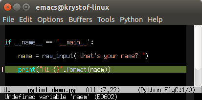



emacs is my favorite editor, and python is my favorite scripting language. Sometimes, though, silly syntax errors in python don't get caught until runtime, which is a really inefficient way of finding them.

This post is a guide in getting started with pylint inside emacs. Pylint does finds syntax and other issues, so you can spot and fix them as soon as you make them. It can also be used to enforce style guides, notably [pep8](http://legacy.python.org/dev/peps/pep-0008/). With the Flycheck emacs extension, pylint's output will be shown right inside your emacs buffers.

## Requirements:
* emacs version 24 or newer
* package manager set up for emacs (I use MELPA - see [here](http://melpa.org/#/getting-started) for instructions on setting it up)
* these instructions were tested on Ubuntu, but may work on other systems as well.

## Step 1: Install Pylint & Flycheck

Installing pylint is easy on Ubuntu:

    sudo apt-get install pylint

Installing Flycheck should also be easy through emacs' package manager. For my setup with MELPA, I can see all the available packages by doing

    M-x package-install RET flycheck
    
inside emacs. The final step is to enable Flycheck. You can either do it for the current buffer (`M-x flycheck-mode`), for the current emacs session (`M-x global-flycheck-mode`), or permanently enable it globally by adding the following line to your .emacs file:

    (add-hook 'after-init-hook #'global-flycheck-mode)

If you now restart emacs and open a python file, flycheck should show you pylint's output for the file.

If you run into any issues, look [here](http://www.pylint.org/#install) for Pylint installation instructions, and [here](https://flycheck.readthedocs.org/en/latest/guide/installation.html) for the Flycheck installation guide.

For me, pylint was *way* too pedantic. Let's look at how you can disable some specific errors and warnings.

## Step 2: Tell Pylint not to be so pedantic

You can configure pylint by using a pylintrc file. I put mine in ~/.pylintrc:

    pylint --generate-rcfile >.pylintrc

You can disable whatever warnings and errors you want by adding the appropriate codes to the "disable=" line in your .pylintrc file. The full list of codes is [here](http://pylint-messages.wikidot.com/all-messages).

Obviously, which ones to disable is a matter of preference. For now, I've set mine to

    disable= CO103, C0326, W0621, C0111, C0103, W0702, W0703, C0321, W0511, W0102,
             R0913, R0914, R0915, R0912, R0902, R0903, C0303, C0302, C0325

I've also upped the maximum number of characters allowed per line to 120 characters by `max-line-length=120`.

And that's it! Emacs should now be a much more powerful python editor for you.
